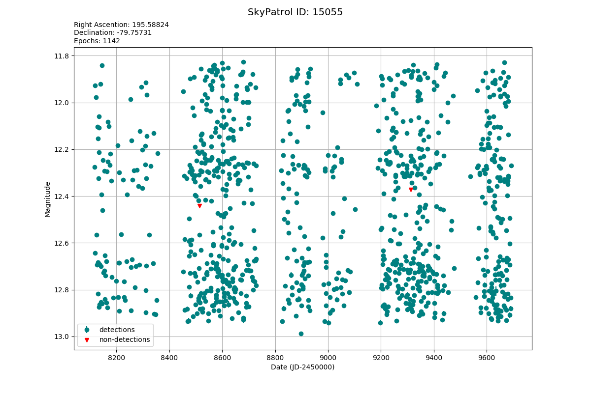

<!-- 

 -->

<p align="center">
  
  <br><br>
  <a href="https://github.com/asas-sn/skypatrol/actions/workflows/tests.yml">
    
  </a>
  <a href="https://asas-sn.github.io/skypatrol/index.html">
    
  </a>
</p>

# ASAS-SN SkyPatrol client

The SkyPatrol pyasassn client allows users to query the ASAS-SN input catalog and retrieve light curves from our photometry database. These light curves are regularly updated with continuous photometry run on nightly images. Read the docs [here](https://asas-sn.github.io/skypatrol/index.html).

### Installation

The easiest way to get started is with pip, using Python 3.6+:

```bash
python -m pip install skypatrol
```

To build from source:
```bash
git clone https://github.com/asas-sn/skypatrol.git
pip3 install skypatrol/
```

### Getting started

The SkyPatrolClient will automatically ping the server for the most recent catalog data, allowing us to query through different methods.

```python
from pyasassn.client import SkyPatrolClient

client = SkyPatrolClient()
client.catalogs
```
    Table Name: stellar_main
    Num Columns: 47
    
    Table Name: master_list
    Num Columns: 4
    
    Table Name: comets
    Num Columns: 1
    
    Table Name: swift
    Num Columns: 56
    
    Table Name: allwiseagn
    Num Columns: 15
    
    Table Name: mdwarf
    Num Columns: 32
    
    Table Name: milliquas
    Num Columns: 21
    
    Table Name: fermi
    Num Columns: 67
    
    Table Name: aavsovsx
    Num Columns: 28
    
    Table Name: morx
    Num Columns: 38
    
    Table Name: chandra
    Num Columns: 516
    
    Table Name: asteroids
    Num Columns: 1


#### Main Catalog

The __stellar_main__ catalog contains the bulk of our targets. It was built off of ATLAS REFCAT2 and contains GAIA, TESS, SDSS, and ALLWISE identifiers where available.


```python
client.catalogs.stellar_main.head(15)
```


<div>
<table border="1" class="dataframe">
<font size="1" face="Courier New" >
  <thead>
    <tr style="text-align: right;">
      <th></th>
      <th>col_names</th>
      <th>dtypes</th>
    </tr>
  </thead>
  <tbody>
    <tr>
      <th>0</th>
      <td>asas_sn_id</td>
      <td>bigint</td>
    </tr>
    <tr>
      <th>1</th>
      <td>ra_deg</td>
      <td>double</td>
    </tr>
    <tr>
      <th>2</th>
      <td>dec_deg</td>
      <td>double</td>
    </tr>
    <tr>
      <th>3</th>
      <td>refcat_id</td>
      <td>bigint</td>
    </tr>
    <tr>
      <th>4</th>
      <td>gaia_id</td>
      <td>bigint</td>
    </tr>
    <tr>
      <th>5</th>
      <td>hip_id</td>
      <td>string</td>
    </tr>
    <tr>
      <th>6</th>
      <td>tyc_id</td>
      <td>string</td>
    </tr>
    <tr>
      <th>7</th>
      <td>tmass_id</td>
      <td>string</td>
    </tr>
    <tr>
      <th>8</th>
      <td>sdss_id</td>
      <td>string</td>
    </tr>
    <tr>
      <th>9</th>
      <td>allwise_id</td>
      <td>string</td>
    </tr>
    <tr>
      <th>10</th>
      <td>tic_id</td>
      <td>bigint</td>
    </tr>
    <tr>
      <th>11</th>
      <td>plx</td>
      <td>float</td>
    </tr>
    <tr>
      <th>12</th>
      <td>plx_d</td>
      <td>float</td>
    </tr>
    <tr>
      <th>13</th>
      <td>pm_ra</td>
      <td>float</td>
    </tr>
    <tr>
      <th>14</th>
      <td>pm_ra_d</td>
      <td>float</td>
    </tr>
  </tbody>
</font>
</table>
</div>


#### HEASARC Catalogs

The remaining catalogs were sourced from NASA's HEASARC archive. Each of these retains its original columnar data, though we have appended an __asas_sn_id__ for all of them.


```python
client.catalogs.aavsovsx.head(12)
```


<div>
<table border="1" class="dataframe">
  <thead>
    <tr style="text-align: right;">
      <th></th>
      <th>col_names</th>
      <th>dtypes</th>
    </tr>
  </thead>
  <tbody>
    <tr>
      <th>0</th>
      <td>asas_sn_id</td>
      <td>bigint</td>
    </tr>
    <tr>
      <th>1</th>
      <td>ra_deg</td>
      <td>double</td>
    </tr>
    <tr>
      <th>2</th>
      <td>dec_deg</td>
      <td>double</td>
    </tr>
    <tr>
      <th>3</th>
      <td>source_number</td>
      <td>bigint</td>
    </tr>
    <tr>
      <th>4</th>
      <td>name</td>
      <td>string</td>
    </tr>
    <tr>
      <th>5</th>
      <td>variability_flag</td>
      <td>bigint</td>
    </tr>
    <tr>
      <th>6</th>
      <td>lii</td>
      <td>double</td>
    </tr>
    <tr>
      <th>7</th>
      <td>bii</td>
      <td>double</td>
    </tr>
    <tr>
      <th>8</th>
      <td>variability_type</td>
      <td>string</td>
    </tr>
    <tr>
      <th>9</th>
      <td>max_mag_type</td>
      <td>double</td>
    </tr>
    <tr>
      <th>10</th>
      <td>max_mag_limit</td>
      <td>string</td>
    </tr>
    <tr>
      <th>11</th>
      <td>max_mag</td>
      <td>double</td>
    </tr>
  </tbody>
</table>
</div>


#### The Master List

The __master_list__ contains __asas_sn_ids__ coordinates and catalog sources for all of our targets. All of our catalogs are cross-matched on the master list with a 2-arcsecond cone. 


```python
client.catalogs.master_list
```


<div>
<table border="1" class="dataframe">
  <thead>
    <tr style="text-align: right;">
      <th></th>
      <th>col_names</th>
      <th>dtypes</th>
    </tr>
  </thead>
  <tbody>
    <tr>
      <th>0</th>
      <td>asas_sn_id</td>
      <td>bigint</td>
    </tr>
    <tr>
      <th>1</th>
      <td>ra_deg</td>
      <td>double</td>
    </tr>
    <tr>
      <th>2</th>
      <td>dec_deg</td>
      <td>double</td>
    </tr>
    <tr>
      <th>3</th>
      <td>catalog_sources</td>
      <td>array&lt;string&gt;</td>
    </tr>
  </tbody>
</table>
</div>


### Cone Seach

Lets run a simple cone-search on the master list. 


```python
client.cone_search(ra_deg=270, dec_deg=88, radius=4, catalog='master_list')
```


<div>
<table border="1" class="dataframe">
  <thead>
    <tr style="text-align: right;">
      <th></th>
      <th>asas_sn_id</th>
      <th>ra_deg</th>
      <th>dec_deg</th>
      <th>catalog_sources</th>
    </tr>
  </thead>
  <tbody>
    <tr>
      <th>0</th>
      <td>8590494153</td>
      <td>270.508480</td>
      <td>84.120395</td>
      <td>[stellar_main, tic]</td>
    </tr>
    <tr>
      <th>1</th>
      <td>8590493551</td>
      <td>257.333476</td>
      <td>84.119978</td>
      <td>[stellar_main, tic]</td>
    </tr>
    <tr>
      <th>2</th>
      <td>8590494160</td>
      <td>273.628334</td>
      <td>84.120183</td>
      <td>[stellar_main, tic]</td>
    </tr>
    <tr>
      <th>3</th>
      <td>8590494620</td>
      <td>282.208531</td>
      <td>84.120019</td>
      <td>[stellar_main, tic]</td>
    </tr>
    <tr>
      <th>4</th>
      <td>8590493763</td>
      <td>257.575614</td>
      <td>84.119906</td>
      <td>[stellar_main, tic]</td>
    </tr>
    <tr>
      <th>...</th>
      <td>...</td>
      <td>...</td>
      <td>...</td>
      <td>...</td>
    </tr>
    <tr>
      <th>82247</th>
      <td>317828630672</td>
      <td>272.518828</td>
      <td>89.284092</td>
      <td>[stellar_main, tic]</td>
    </tr>
    <tr>
      <th>82248</th>
      <td>317828630205</td>
      <td>0.339976</td>
      <td>89.284143</td>
      <td>[stellar_main, tic]</td>
    </tr>
    <tr>
      <th>82249</th>
      <td>317828630428</td>
      <td>142.968424</td>
      <td>89.283984</td>
      <td>[stellar_main, tic]</td>
    </tr>
    <tr>
      <th>82250</th>
      <td>317828630825</td>
      <td>353.474920</td>
      <td>89.284470</td>
      <td>[stellar_main, tic]</td>
    </tr>
    <tr>
      <th>82251</th>
      <td>317828648971</td>
      <td>71.616242</td>
      <td>89.752714</td>
      <td>[stellar_main, tic]</td>
    </tr>
  </tbody>
</table>
<p>82252 rows × 4 columns</p>
</div>


### Random Curves 

For whatever reason, if you are interested in random targets from a given catalog, we can give you those too.


```python
client.random_sample(1000, catalog="aavsovsx")
```


<div>
<table border="1" class="dataframe">
  <thead>
    <tr style="text-align: right;">
      <th></th>
      <th>asas_sn_id</th>
      <th>ra_deg</th>
      <th>dec_deg</th>
      <th>name</th>
    </tr>
  </thead>
  <tbody>
    <tr>
      <th>0</th>
      <td>661427528626</td>
      <td>11.36008</td>
      <td>-88.53342</td>
      <td>MASTER OT J004526.42-883200.3</td>
    </tr>
    <tr>
      <th>1</th>
      <td>17181143984</td>
      <td>113.42148</td>
      <td>-87.67768</td>
      <td>WISE J073341.1-874039</td>
    </tr>
    <tr>
      <th>2</th>
      <td>17181129184</td>
      <td>276.53493</td>
      <td>-86.82375</td>
      <td>ASASSN-V J182608.32-864925.1</td>
    </tr>
    <tr>
      <th>3</th>
      <td>661427528887</td>
      <td>294.50733</td>
      <td>-86.65919</td>
      <td>ASASSN-14ft</td>
    </tr>
    <tr>
      <th>4</th>
      <td>1118197</td>
      <td>313.27013</td>
      <td>-85.89292</td>
      <td>ASASSN-V J205304.83-855334.5</td>
    </tr>
    <tr>
      <th>...</th>
      <td>...</td>
      <td>...</td>
      <td>...</td>
      <td>...</td>
    </tr>
    <tr>
      <th>995</th>
      <td>515397078518</td>
      <td>265.46100</td>
      <td>-41.78668</td>
      <td>ASASSN-V J174150.64-414712.0</td>
    </tr>
    <tr>
      <th>996</th>
      <td>515397087473</td>
      <td>210.81929</td>
      <td>-41.72133</td>
      <td>ASASSN-V J140316.63-414316.8</td>
    </tr>
    <tr>
      <th>997</th>
      <td>412316933534</td>
      <td>8.80896</td>
      <td>-41.72128</td>
      <td>ASAS J003514-4143.2</td>
    </tr>
    <tr>
      <th>998</th>
      <td>515397087308</td>
      <td>210.42030</td>
      <td>-41.72102</td>
      <td>SSS_J140141.0-414314</td>
    </tr>
    <tr>
      <th>999</th>
      <td>412316939243</td>
      <td>106.25032</td>
      <td>-41.72086</td>
      <td>SSS_J070500.0-414314</td>
    </tr>
  </tbody>
</table>
<p>1000 rows × 4 columns</p>
</div>


### Query Lists

If you have a list of external identifiers you can query our catalogs using these. 
For the __stellar_main__ catalog, use the __id_col__ parameter.
For other catalogs you can search by name.


```python
my_tic_ids = [6658326, 46783395, 1021890]
client.query_list(my_tic_ids, catalog='stellar_main', id_col='tic_id')
```


<div>
<table border="1" class="dataframe">
  <thead>
    <tr style="text-align: right;">
      <th></th>
      <th>asas_sn_id</th>
      <th>ra_deg</th>
      <th>dec_deg</th>
    </tr>
  </thead>
  <tbody>
    <tr>
      <th>0</th>
      <td>309238124040</td>
      <td>329.260377</td>
      <td>-8.035864</td>
    </tr>
    <tr>
      <th>1</th>
      <td>335007699083</td>
      <td>97.045759</td>
      <td>18.214838</td>
    </tr>
    <tr>
      <th>2</th>
      <td>335007693701</td>
      <td>81.164422</td>
      <td>18.222147</td>
    </tr>
  </tbody>
</table>
</div>


```python
my_vso_id = 'ASASSN-V J182608.32-864925.1'
client.query_list(my_vso_id, catalog='aavsovsx')
```


<div>
<table border="1" class="dataframe">
  <thead>
    <tr style="text-align: right;">
      <th></th>
      <th>asas_sn_id</th>
      <th>ra_deg</th>
      <th>dec_deg</th>
      <th>name</th>
    </tr>
  </thead>
  <tbody>
    <tr>
      <th>0</th>
      <td>17181129184</td>
      <td>276.53493</td>
      <td>-86.82375</td>
      <td>ASASSN-V J182608.32-864925.1</td>
    </tr>
  </tbody>
</table>
</div>


### ADQL Queries

We have inculded a custom ADQL parser. That will allow users to query targets using this familiar SQL-like language. 
First, take note how we can use this to perform a cone-search.


```python
query = """
SELECT 
 * 
FROM stellar_main 
WHERE DISTANCE(ra_deg, dec_deg, 270, -88) <= 5.1
"""
client.adql_query(query)
```


<div>
<table border="1" class="dataframe">
  <thead>
    <tr style="text-align: right;">
      <th></th>
      <th>asas_sn_id</th>
      <th>ra_deg</th>
      <th>dec_deg</th>
      <th>refcat_id</th>
      <th>gaia_id</th>
      <th>hip_id</th>
      <th>tyc_id</th>
      <th>tmass_id</th>
      <th>sdss_id</th>
      <th>allwise_id</th>
      <th>...</th>
      <th>pstarrs_r_mag_contrib</th>
      <th>pstarrs_i_mag</th>
      <th>pstarrs_i_mag_d</th>
      <th>pstarrs_i_mag_chi</th>
      <th>pstarrs_i_mag_contrib</th>
      <th>pstarrs_z_mag</th>
      <th>pstarrs_z_mag_d</th>
      <th>pstarrs_z_mag_chi</th>
      <th>pstarrs_z_mag_contrib</th>
      <th>nstat</th>
    </tr>
  </thead>
  <tbody>
    <tr>
      <th>0</th>
      <td>1094902</td>
      <td>14.059417</td>
      <td>-89.846361</td>
      <td>180140594164367</td>
      <td>4611690901807713792</td>
      <td>None</td>
      <td>None</td>
      <td>None</td>
      <td>None</td>
      <td>None</td>
      <td>...</td>
      <td>1</td>
      <td>16.174999</td>
      <td>0.100</td>
      <td>0.00</td>
      <td>1</td>
      <td>15.810000</td>
      <td>0.100</td>
      <td>0.00</td>
      <td>1</td>
      <td>0</td>
    </tr>
    <tr>
      <th>1</th>
      <td>1099017</td>
      <td>182.038926</td>
      <td>-89.804971</td>
      <td>231820389264035</td>
      <td>5764625115221143040</td>
      <td>None</td>
      <td>None</td>
      <td>None</td>
      <td>None</td>
      <td>None</td>
      <td>...</td>
      <td>1</td>
      <td>17.544001</td>
      <td>0.100</td>
      <td>0.00</td>
      <td>1</td>
      <td>17.448000</td>
      <td>0.100</td>
      <td>0.00</td>
      <td>1</td>
      <td>0</td>
    </tr>
    <tr>
      <th>2</th>
      <td>1105675</td>
      <td>309.260296</td>
      <td>-89.743042</td>
      <td>303092602958351</td>
      <td>6341076010576210432</td>
      <td>None</td>
      <td>None</td>
      <td>None</td>
      <td>None</td>
      <td>None</td>
      <td>...</td>
      <td>33</td>
      <td>12.147000</td>
      <td>0.021</td>
      <td>0.03</td>
      <td>33</td>
      <td>11.933000</td>
      <td>0.100</td>
      <td>0.01</td>
      <td>1</td>
      <td>0</td>
    </tr>
    <tr>
      <th>3</th>
      <td>1109079</td>
      <td>39.243573</td>
      <td>-89.709996</td>
      <td>340392435728006</td>
      <td>4611694161685666944</td>
      <td>None</td>
      <td>None</td>
      <td>None</td>
      <td>None</td>
      <td>None</td>
      <td>...</td>
      <td>1</td>
      <td>17.083000</td>
      <td>0.100</td>
      <td>0.00</td>
      <td>1</td>
      <td>16.879000</td>
      <td>0.100</td>
      <td>0.00</td>
      <td>1</td>
      <td>0</td>
    </tr>
    <tr>
      <th>4</th>
      <td>1110860</td>
      <td>281.009406</td>
      <td>-89.701636</td>
      <td>352810094058038</td>
      <td>6341087418009385600</td>
      <td>None</td>
      <td>None</td>
      <td>None</td>
      <td>None</td>
      <td>None</td>
      <td>...</td>
      <td>33</td>
      <td>16.521000</td>
      <td>0.100</td>
      <td>0.00</td>
      <td>1</td>
      <td>16.492001</td>
      <td>0.100</td>
      <td>0.00</td>
      <td>1</td>
      <td>0</td>
    </tr>
    <tr>
      <th>...</th>
      <td>...</td>
      <td>...</td>
      <td>...</td>
      <td>...</td>
      <td>...</td>
      <td>...</td>
      <td>...</td>
      <td>...</td>
      <td>...</td>
      <td>...</td>
      <td>...</td>
      <td>...</td>
      <td>...</td>
      <td>...</td>
      <td>...</td>
      <td>...</td>
      <td>...</td>
      <td>...</td>
      <td>...</td>
      <td>...</td>
      <td>...</td>
    </tr>
    <tr>
      <th>245123</th>
      <td>77310219747</td>
      <td>256.853379</td>
      <td>-83.001130</td>
      <td>8392568533788677</td>
      <td>5773920596978196224</td>
      <td>None</td>
      <td>None</td>
      <td>None</td>
      <td>None</td>
      <td>None</td>
      <td>...</td>
      <td>41</td>
      <td>16.059000</td>
      <td>0.022</td>
      <td>3.28</td>
      <td>41</td>
      <td>15.903000</td>
      <td>0.028</td>
      <td>0.00</td>
      <td>9</td>
      <td>1</td>
    </tr>
    <tr>
      <th>245124</th>
      <td>77310248925</td>
      <td>260.635568</td>
      <td>-82.997364</td>
      <td>8402606355683196</td>
      <td>5773744258504279552</td>
      <td>None</td>
      <td>None</td>
      <td>None</td>
      <td>None</td>
      <td>None</td>
      <td>...</td>
      <td>1</td>
      <td>16.035999</td>
      <td>0.090</td>
      <td>0.02</td>
      <td>1</td>
      <td>15.943000</td>
      <td>0.090</td>
      <td>0.00</td>
      <td>1</td>
      <td>0</td>
    </tr>
    <tr>
      <th>245125</th>
      <td>266288894288</td>
      <td>276.533820</td>
      <td>-82.974527</td>
      <td>8432765338190601</td>
      <td>6359213240854465280</td>
      <td>None</td>
      <td>None</td>
      <td>None</td>
      <td>None</td>
      <td>None</td>
      <td>...</td>
      <td>41</td>
      <td>16.825001</td>
      <td>0.053</td>
      <td>0.36</td>
      <td>9</td>
      <td>16.875000</td>
      <td>0.024</td>
      <td>1.32</td>
      <td>9</td>
      <td>0</td>
    </tr>
    <tr>
      <th>245126</th>
      <td>77310240409</td>
      <td>278.626894</td>
      <td>-82.946876</td>
      <td>8462786268933782</td>
      <td>6359204964453699328</td>
      <td>None</td>
      <td>None</td>
      <td>None</td>
      <td>None</td>
      <td>None</td>
      <td>...</td>
      <td>9</td>
      <td>16.986000</td>
      <td>0.025</td>
      <td>0.31</td>
      <td>9</td>
      <td>16.709000</td>
      <td>0.046</td>
      <td>0.43</td>
      <td>9</td>
      <td>0</td>
    </tr>
    <tr>
      <th>245127</th>
      <td>77310268049</td>
      <td>263.648603</td>
      <td>-82.935546</td>
      <td>8472636486037378</td>
      <td>5773736699361849344</td>
      <td>None</td>
      <td>None</td>
      <td>None</td>
      <td>None</td>
      <td>None</td>
      <td>...</td>
      <td>9</td>
      <td>17.495001</td>
      <td>0.059</td>
      <td>0.46</td>
      <td>9</td>
      <td>17.431000</td>
      <td>0.025</td>
      <td>0.25</td>
      <td>9</td>
      <td>0</td>
    </tr>
  </tbody>
</table>
<p>245128 rows × 47 columns</p>
</div>


##### JOINS
Since we have cross matched all of our catalogs. We can use ADQL to explore targets accross catalogs.


```python
query = """
SELECT 
 asas_sn_id,
 chandra.name AS c_name,
 swift.name AS s_name  
FROM chandra 
JOIN swift USING(asas_sn_id) 
"""
client.adql_query(query)
```


<div>
<table border="1" class="dataframe">
  <thead>
    <tr style="text-align: right;">
      <th></th>
      <th>asas_sn_id</th>
      <th>c_name</th>
      <th>s_name</th>
    </tr>
  </thead>
  <tbody>
    <tr>
      <th>0</th>
      <td>661430542782</td>
      <td>2CXO J165358.5-395225</td>
      <td>GROJ1655-40</td>
    </tr>
    <tr>
      <th>1</th>
      <td>661430564327</td>
      <td>2CXO J174544.4-285744</td>
      <td>GALACTICCENTER</td>
    </tr>
    <tr>
      <th>2</th>
      <td>661430563309</td>
      <td>2CXO J174538.4-285744</td>
      <td>GALACTICCENTER</td>
    </tr>
    <tr>
      <th>3</th>
      <td>661430490720</td>
      <td>2CXO J132524.3-430110</td>
      <td>CenA</td>
    </tr>
    <tr>
      <th>4</th>
      <td>661430501688</td>
      <td>2CXO J140304.7+541924</td>
      <td>PTF11kly</td>
    </tr>
    <tr>
      <th>...</th>
      <td>...</td>
      <td>...</td>
      <td>...</td>
    </tr>
    <tr>
      <th>472</th>
      <td>661430562283</td>
      <td>2CXO J174532.1-290054</td>
      <td>GALACTICCENTER</td>
    </tr>
    <tr>
      <th>473</th>
      <td>661430562286</td>
      <td>2CXO J174545.7-290054</td>
      <td>GALACTICCENTER</td>
    </tr>
    <tr>
      <th>474</th>
      <td>661430561004</td>
      <td>2CXO J174547.5-290053</td>
      <td>GALACTICCENTER</td>
    </tr>
    <tr>
      <th>475</th>
      <td>661430562813</td>
      <td>2CXO J174547.4-290052</td>
      <td>GALACTICCENTER</td>
    </tr>
    <tr>
      <th>476</th>
      <td>661430468363</td>
      <td>2CXO J121900.0+472049</td>
      <td>NGC4258</td>
    </tr>
  </tbody>
</table>
<p>477 rows × 3 columns</p>
</div>


#### Complex Searches

Lets say we were searching for white dwarfs that crossmatched in the VSO catalog.


```python
query = """
SELECT 
  asas_sn_id,
  gaia_id,
  pstarrs_g_mag,
  (gaia_mag - (5 * LOG10(plx) - 10)) AS g_mag_abs, 
  name 
FROM stellar_main 
JOIN aavsovsx USING(asas_sn_id)
WHERE 1=1
 AND pstarrs_g_mag < 14 
 AND (gaia_mag - (5 * LOG10(plx) - 10)) > 10
 AND (gaia_b_mag - gaia_r_mag) < 1.5 
"""
client.adql_query(query)
```


<div>
<table border="1" class="dataframe">
  <thead>
    <tr style="text-align: right;">
      <th></th>
      <th>asas_sn_id</th>
      <th>gaia_id</th>
      <th>pstarrs_g_mag</th>
      <th>g_mag_abs</th>
      <th>name</th>
    </tr>
  </thead>
  <tbody>
    <tr>
      <th>0</th>
      <td>81666</td>
      <td>5775496815616520960</td>
      <td>11.407</td>
      <td>19.708543</td>
      <td>ASAS J170324-7937.2</td>
    </tr>
    <tr>
      <th>1</th>
      <td>118602</td>
      <td>5785843769793058048</td>
      <td>10.258</td>
      <td>16.563561</td>
      <td>ASAS J142524-7758.4</td>
    </tr>
    <tr>
      <th>2</th>
      <td>588857</td>
      <td>1055430973963102848</td>
      <td>11.696</td>
      <td>15.816850</td>
      <td>NSV 5012</td>
    </tr>
    <tr>
      <th>3</th>
      <td>728404</td>
      <td>2286601456945437952</td>
      <td>8.677</td>
      <td>16.979321</td>
      <td>V0462 Cep</td>
    </tr>
    <tr>
      <th>4</th>
      <td>882997</td>
      <td>2296982083661854592</td>
      <td>13.810</td>
      <td>25.175794</td>
      <td>WISE J211009.8+791037</td>
    </tr>
    <tr>
      <th>...</th>
      <td>...</td>
      <td>...</td>
      <td>...</td>
      <td>...</td>
      <td>...</td>
    </tr>
    <tr>
      <th>86597</th>
      <td>652835029334</td>
      <td>5923382022937143680</td>
      <td>13.345</td>
      <td>24.216244</td>
      <td>ASASSN-V J171026.75-553046.2</td>
    </tr>
    <tr>
      <th>86598</th>
      <td>652835270742</td>
      <td>5894443632805934976</td>
      <td>9.793</td>
      <td>17.875823</td>
      <td>HD 127021</td>
    </tr>
    <tr>
      <th>86599</th>
      <td>652835624417</td>
      <td>5334925216491199360</td>
      <td>12.149</td>
      <td>24.397192</td>
      <td>GDS_J1142208-613045</td>
    </tr>
    <tr>
      <th>86600</th>
      <td>661425088337</td>
      <td>5258317985093107072</td>
      <td>11.683</td>
      <td>21.799361</td>
      <td>IV Car</td>
    </tr>
    <tr>
      <th>86601</th>
      <td>661425544613</td>
      <td>5335409796224181376</td>
      <td>11.922</td>
      <td>22.474754</td>
      <td>ASASSN-V J114927.29-601925.8</td>
    </tr>
  </tbody>
</table>
<p>86602 rows × 5 columns</p>
</div>


#### Downloading Curves

Any of the previous functions can take __mode='download_curves'__ as a parameter to download the lightcurves coresponding to these targets. 

The client will return a LightCurveCollection object which can be used for further analysis and plotting.


```python
# Should take about 1-2 minutes
lcs = client.adql_query(query, mode="download_curves", threads=2)
lcs.data
```


<div>
<table border="1" class="dataframe">
  <thead>
    <tr style="text-align: right;">
      <th></th>
      <th>jd</th>
      <th>flux</th>
      <th>flux_err</th>
      <th>mag</th>
      <th>mag_err</th>
      <th>limit</th>
      <th>fwhm</th>
      <th>asas_sn_id</th>
      <th>cam</th>
    </tr>
  </thead>
  <tbody>
    <tr>
      <th>0</th>
      <td>2.458829e+06</td>
      <td>20.342858</td>
      <td>0.088424</td>
      <td>13.129036</td>
      <td>0.004725</td>
      <td>17.286221</td>
      <td>1.44</td>
      <td>8590141875</td>
      <td>bC</td>
    </tr>
    <tr>
      <th>1</th>
      <td>2.458799e+06</td>
      <td>18.665619</td>
      <td>0.087248</td>
      <td>13.222460</td>
      <td>0.005081</td>
      <td>17.300755</td>
      <td>1.43</td>
      <td>8590141875</td>
      <td>bC</td>
    </tr>
    <tr>
      <th>2</th>
      <td>2.458828e+06</td>
      <td>19.152875</td>
      <td>0.076590</td>
      <td>13.194481</td>
      <td>0.004347</td>
      <td>17.442213</td>
      <td>1.46</td>
      <td>8590141875</td>
      <td>bC</td>
    </tr>
    <tr>
      <th>3</th>
      <td>2.458486e+06</td>
      <td>20.587438</td>
      <td>0.018324</td>
      <td>13.116060</td>
      <td>0.000967</td>
      <td>18.995069</td>
      <td>1.66</td>
      <td>8590141875</td>
      <td>bC</td>
    </tr>
    <tr>
      <th>4</th>
      <td>2.458676e+06</td>
      <td>19.333177</td>
      <td>0.089922</td>
      <td>13.184308</td>
      <td>0.005056</td>
      <td>17.267982</td>
      <td>1.50</td>
      <td>8590141875</td>
      <td>bC</td>
    </tr>
    <tr>
      <th>...</th>
      <td>...</td>
      <td>...</td>
      <td>...</td>
      <td>...</td>
      <td>...</td>
      <td>...</td>
      <td>...</td>
      <td>...</td>
      <td>...</td>
    </tr>
    <tr>
      <th>67</th>
      <td>2.458767e+06</td>
      <td>11.306272</td>
      <td>0.104996</td>
      <td>13.766767</td>
      <td>0.010094</td>
      <td>17.099706</td>
      <td>2.09</td>
      <td>627065865626</td>
      <td>bF</td>
    </tr>
    <tr>
      <th>68</th>
      <td>2.458735e+06</td>
      <td>11.481891</td>
      <td>0.097641</td>
      <td>13.750032</td>
      <td>0.009243</td>
      <td>17.178560</td>
      <td>2.05</td>
      <td>627065865626</td>
      <td>bF</td>
    </tr>
    <tr>
      <th>69</th>
      <td>2.458728e+06</td>
      <td>11.532006</td>
      <td>0.087781</td>
      <td>13.745303</td>
      <td>0.008274</td>
      <td>17.294142</td>
      <td>1.98</td>
      <td>627065865626</td>
      <td>bF</td>
    </tr>
    <tr>
      <th>70</th>
      <td>2.458690e+06</td>
      <td>8.161064</td>
      <td>0.085658</td>
      <td>14.120699</td>
      <td>0.011409</td>
      <td>17.320725</td>
      <td>1.98</td>
      <td>627065865626</td>
      <td>bF</td>
    </tr>
    <tr>
      <th>71</th>
      <td>2.458608e+06</td>
      <td>11.419176</td>
      <td>0.054434</td>
      <td>13.755979</td>
      <td>0.005181</td>
      <td>17.812959</td>
      <td>1.45</td>
      <td>627065865626</td>
      <td>bF</td>
    </tr>
  </tbody>
</table>
<p>10357650 rows × 9 columns</p>
</div>


```python
lcs.stats()
```


<div>
<table border="1" class="dataframe">
  <thead>
    <tr style="text-align: right;">
      <th></th>
      <th>mean_mag</th>
      <th>std_mag</th>
      <th>epochs</th>
    </tr>
    <tr>
      <th>asas_sn_id</th>
      <th></th>
      <th></th>
      <th></th>
    </tr>
  </thead>
  <tbody>
    <tr>
      <th>6722</th>
      <td>13.713655</td>
      <td>0.143119</td>
      <td>557</td>
    </tr>
    <tr>
      <th>7205</th>
      <td>9.354485</td>
      <td>0.433855</td>
      <td>243</td>
    </tr>
    <tr>
      <th>10138</th>
      <td>11.980529</td>
      <td>0.032530</td>
      <td>410</td>
    </tr>
    <tr>
      <th>12702</th>
      <td>13.071251</td>
      <td>0.166151</td>
      <td>547</td>
    </tr>
    <tr>
      <th>15055</th>
      <td>12.448167</td>
      <td>0.345866</td>
      <td>235</td>
    </tr>
    <tr>
      <th>...</th>
      <td>...</td>
      <td>...</td>
      <td>...</td>
    </tr>
    <tr>
      <th>661425547786</th>
      <td>13.487700</td>
      <td>0.105852</td>
      <td>137</td>
    </tr>
    <tr>
      <th>661425547969</th>
      <td>13.287609</td>
      <td>0.141784</td>
      <td>54</td>
    </tr>
    <tr>
      <th>661425548441</th>
      <td>13.690842</td>
      <td>0.124418</td>
      <td>157</td>
    </tr>
    <tr>
      <th>661425548470</th>
      <td>11.917627</td>
      <td>0.024326</td>
      <td>143</td>
    </tr>
    <tr>
      <th>661425548591</th>
      <td>13.108276</td>
      <td>0.067760</td>
      <td>157</td>
    </tr>
  </tbody>
</table>
<p>86539 rows × 3 columns</p>
</div>


```python
lightcurve = lcs[15055]
lightcurve.meta
```


<div>
<table border="1" class="dataframe">
  <thead>
    <tr style="text-align: right;">
      <th></th>
      <th>asas_sn_id</th>
      <th>gaia_id</th>
      <th>pstarrs_g_mag</th>
      <th>g_mag_abs</th>
      <th>name</th>
    </tr>
  </thead>
  <tbody>
    <tr>
      <th>67265</th>
      <td>15055</td>
      <td>5784674881551467392</td>
      <td>12.351</td>
      <td>24.402487</td>
      <td>BV Cha</td>
    </tr>
  </tbody>
</table>
</div>


```python
lightcurve.plot()
```





```python
client.adql_query("SELECT * FROM aavsovsx WHERE asas_sn_id = 15055")
```


<div>
<table border="1" class="dataframe">
  <thead>
    <tr style="text-align: right;">
      <th></th>
      <th>asas_sn_id</th>
      <th>ra_deg</th>
      <th>dec_deg</th>
      <th>source_number</th>
      <th>name</th>
      <th>variability_flag</th>
      <th>lii</th>
      <th>bii</th>
      <th>variability_type</th>
      <th>max_mag_type</th>
      <th>...</th>
      <th>min_mag_system</th>
      <th>epoch</th>
      <th>epoch_flag</th>
      <th>period_limit</th>
      <th>period</th>
      <th>period_flag</th>
      <th>ref_bibcode_1</th>
      <th>ref_bibcode_2</th>
      <th>ref_bibcode_others</th>
      <th>class</th>
    </tr>
  </thead>
  <tbody>
    <tr>
      <th>0</th>
      <td>15055</td>
      <td>195.58829</td>
      <td>-79.75731</td>
      <td>9336</td>
      <td>BV Cha</td>
      <td>0</td>
      <td>303.438856</td>
      <td>-16.896307</td>
      <td>CWB</td>
      <td>NaN</td>
      <td>...</td>
      <td>V</td>
      <td>2451872.85</td>
      <td>None</td>
      <td>None</td>
      <td>1.23804</td>
      <td>None</td>
      <td>1963VeSon...6....1H</td>
      <td>2009yCat....102025S</td>
      <td>None</td>
      <td>2900</td>
    </tr>
  </tbody>
</table>
<p>1 rows × 28 columns</p>
</div>


```python

```
